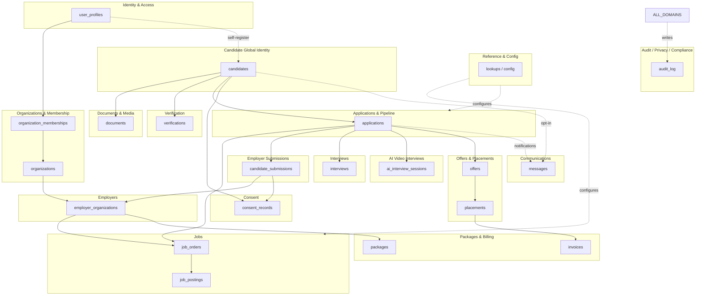
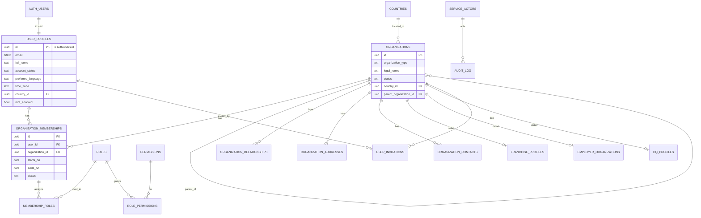
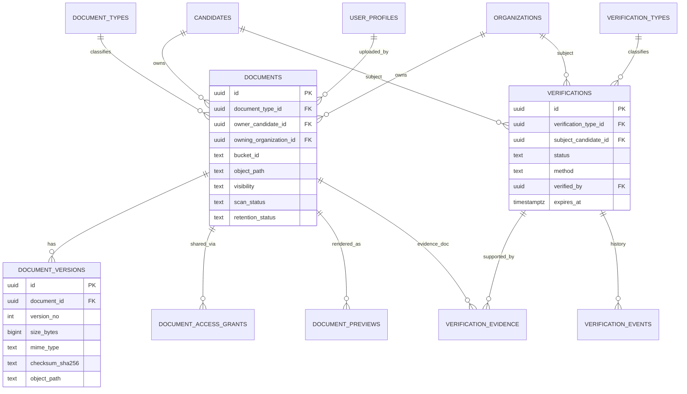
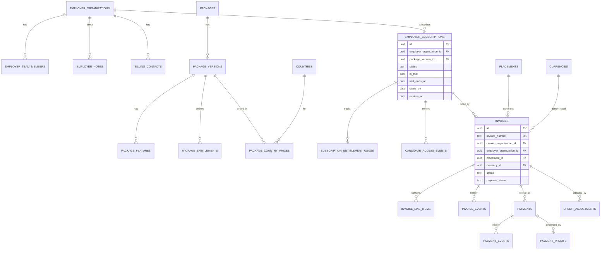
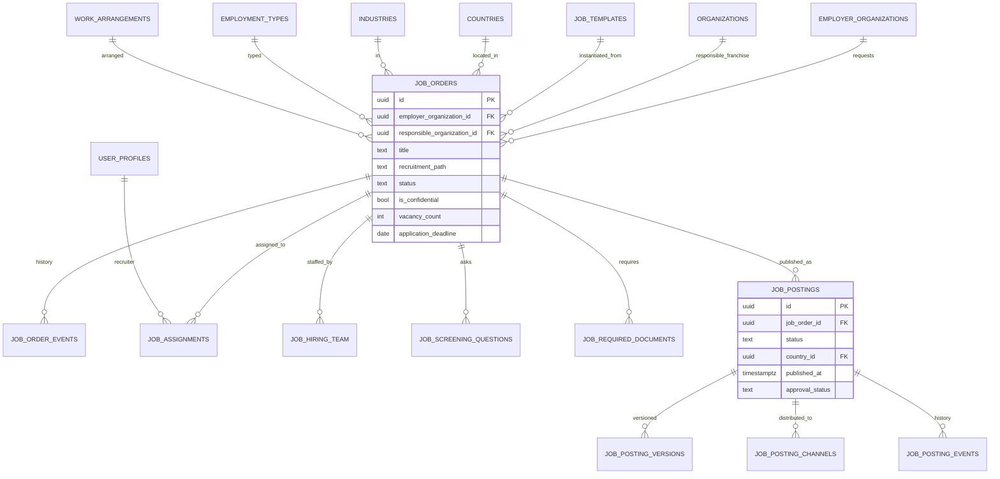
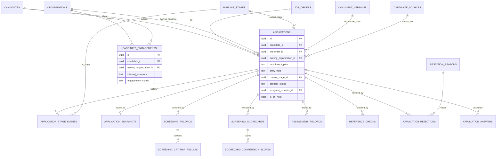
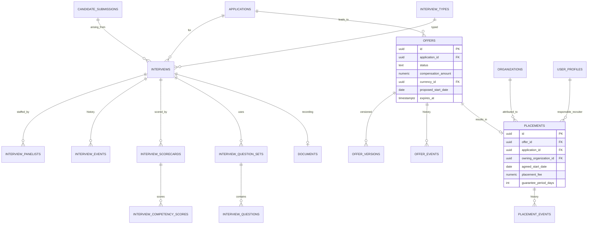
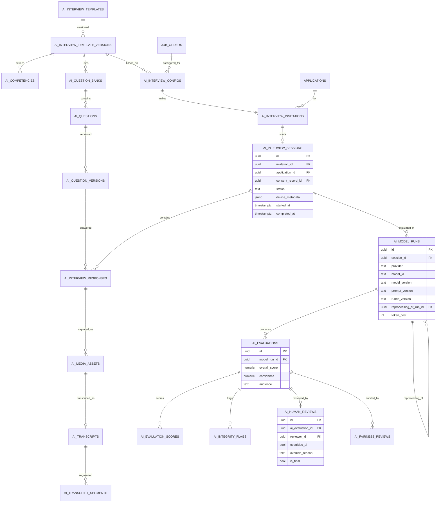
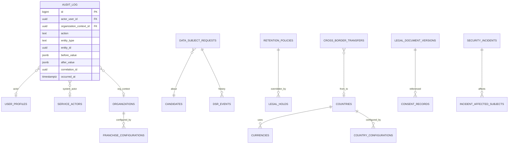

# 03 — Entity-Relationship Diagrams

Diagrams are split by domain for readability, preceded by a high-level map showing how the domains connect. Mermaid `erDiagram` notation. Relationship crow's-feet: `||--o{` = one-to-many, `||--||` = one-to-one, `}o--o{` = many-to-many (via a join table shown explicitly).

Full column lists are in `04-data-dictionary.md`; these diagrams show keys and principal relationships only.

---

## 0. High-level domain map



*(`ALL_DOMAINS` is illustrative: audit is written from every domain.)*

**Reading the spine:** `candidates` → `applications` → `job_orders`; Path B adds `candidate_submissions` → `employer_organizations`; success flows `offers` → `placements` → `invoices`. Consent gates the `candidate_submissions` edge. Search (Ring 2) and dashboards are derived, not shown.

---

## 1. Identity, Organizations & Membership



---

## 2. Candidate Global Identity (Rings 1 & 2)

```mermaid
erDiagram
  CANDIDATES ||--o| USER_PROFILES : "user_id (nullable)"
  CANDIDATES ||--o{ CANDIDATE_WORK_EXPERIENCES : has
  CANDIDATES ||--o{ CANDIDATE_EDUCATIONS : has
  CANDIDATES ||--o{ CANDIDATE_SKILLS : has
  CANDIDATES ||--o{ CANDIDATE_LANGUAGES : has
  CANDIDATES ||--o{ CANDIDATE_CERTIFICATIONS : has
  CANDIDATES ||--o{ CANDIDATE_LICENCES : has
  CANDIDATES ||--o{ CANDIDATE_PROJECTS : has
  CANDIDATES ||--o{ CANDIDATE_MEMBERSHIPS : has
  CANDIDATES ||--o{ CANDIDATE_REFERENCES : has
  CANDIDATES ||--|| CANDIDATE_PREFERENCES : has
  CANDIDATES ||--o{ CANDIDATE_PREFERRED_ROLES : has
  CANDIDATES ||--o{ CANDIDATE_PREFERRED_INDUSTRIES : has
  CANDIDATES ||--o{ CANDIDATE_PREFERRED_LOCATIONS : has
  CANDIDATES ||--|| CANDIDATE_VISIBILITY : has
  CANDIDATES ||--o{ CANDIDATE_TAGS : has
  CANDIDATES ||--|| CANDIDATE_SEARCH_DOCUMENTS : indexed_as
  CANDIDATES ||--o{ CANDIDATE_DUPLICATE_LINKS : suspected
  SKILLS ||--o{ CANDIDATE_SKILLS : referenced
  INDUSTRIES ||--o{ CANDIDATE_PREFERRED_INDUSTRIES : referenced
  LANGUAGES ||--o{ CANDIDATE_LANGUAGES : referenced
  EDUCATION_LEVELS ||--o{ CANDIDATE_EDUCATIONS : referenced

  CANDIDATES {
    uuid id PK
    uuid user_id FK "nullable (recruiter-created)"
    text given_name
    text family_name
    date date_of_birth
    citext email
    text phone
    uuid country_id FK
    text profile_status
    text source_channel
    int profile_completion_pct
  }
  CANDIDATE_VISIBILITY {
    uuid candidate_id PK,FK
    bool searchable
    jsonb approved_search_fields
  }
  CANDIDATE_SEARCH_DOCUMENTS {
    uuid candidate_id PK,FK
    tsvector search_tsv
    text[] approved_skills
    text country_city
  }
```



---

## 3. Documents & Media, Verification



---

## 4. Employers, Packages & Billing



---

## 5. Jobs (order / publication / approval)



---

## 6. Applications & Recruiter Pipeline (Ring 3a)



---

## 7. Employer Submissions (Ring 3b) & Consent

```mermaid
erDiagram
  APPLICATIONS ||--o{ CANDIDATE_SUBMISSIONS : submitted_as
  CANDIDATES ||--o{ CANDIDATE_SUBMISSIONS : about
  JOB_ORDERS ||--o{ CANDIDATE_SUBMISSIONS : for
  EMPLOYER_ORGANIZATIONS ||--o{ CANDIDATE_SUBMISSIONS : to
  ORGANIZATIONS ||--o{ CANDIDATE_SUBMISSIONS : submitting_franchise
  CANDIDATE_SUBMISSIONS ||--|| SUBMISSION_SNAPSHOTS : frozen_as
  CANDIDATE_SUBMISSIONS ||--o{ SUBMISSION_DOCUMENTS : discloses
  CANDIDATE_SUBMISSIONS ||--o{ SUBMISSION_EVENTS : history
  CANDIDATE_SUBMISSIONS ||--o{ SUBMISSION_VIEWS : viewed_in
  CANDIDATE_SUBMISSIONS ||--o{ SUBMISSION_COMMENTS : commented
  CANDIDATE_SUBMISSIONS ||--o{ SUBMISSION_RATINGS : rated
  CANDIDATE_SUBMISSIONS }o--|| CONSENT_RECORDS : authorized_by
  DOCUMENT_VERSIONS ||--o{ SUBMISSION_DOCUMENTS : shared_version

  CONSENT_RECORDS }o--|| CONSENT_PURPOSES : for
  CONSENT_RECORDS }o--|| LEGAL_DOCUMENT_VERSIONS : shown
  CANDIDATES ||--o{ CONSENT_RECORDS : subject
  ORGANIZATIONS ||--o{ CONSENT_RECORDS : covered_recipient
  EMPLOYER_ORGANIZATIONS ||--o{ CONSENT_RECORDS : covered_recipient

  CANDIDATE_SUBMISSIONS {
    uuid id PK
    uuid application_id FK
    uuid candidate_id FK
    uuid employer_organization_id FK
    uuid submitting_organization_id FK
    uuid consent_record_id FK
    text status
    bool is_masked
    timestamptz access_expires_at
    timestamptz access_revoked_at
  }
  CONSENT_RECORDS {
    uuid id PK
    uuid subject_candidate_id FK
    uuid consent_purpose_id FK
    uuid covered_organization_id FK
    uuid legal_document_version_id FK
    text method
    timestamptz granted_at
    timestamptz expires_at
    timestamptz withdrawn_at
  }
```

---

## 8. Interviews (human) & Offers/Placements



---

## 9. AI Video Interviews (six sub-graphs)



---

## 10. Communications, Notes/Tasks, Whistleblowing

```mermaid
erDiagram
  MESSAGE_TEMPLATES ||--o{ MESSAGE_TEMPLATE_VERSIONS : versioned
  NOTIFICATION_CATEGORIES ||--o{ MESSAGE_TEMPLATES : categorizes
  MESSAGE_TEMPLATE_VERSIONS ||--o{ MESSAGES : rendered_from
  MESSAGES ||--o{ MESSAGE_RECIPIENTS : to
  MESSAGE_RECIPIENTS ||--o{ MESSAGE_DELIVERIES : delivered_via
  CHANNELS ||--o{ MESSAGE_DELIVERIES : over
  USER_PROFILES ||--o{ COMMUNICATION_PREFERENCES : sets
  CANDIDATES ||--o{ COMMUNICATION_PREFERENCES : sets
  NOTIFICATION_CATEGORIES ||--o{ COMMUNICATION_PREFERENCES : for
  USER_PROFILES ||--o{ IN_APP_NOTIFICATIONS : receives

  NOTES }o--|| NOTE_VISIBILITIES : scoped_by
  ORGANIZATIONS ||--o{ NOTES : owning_org
  USER_PROFILES ||--o{ NOTES : author
  TASKS }o--|| USER_PROFILES : assignee
  ACTIVITY_EVENTS }o--|| ORGANIZATIONS : owning_org

  SAFEGUARDING_CASES ||--o{ SAFEGUARDING_CASE_EVENTS : history
  SAFEGUARDING_CASES }o--o| CANDIDATES : reporter_optional

  MESSAGE_DELIVERIES {
    uuid id PK
    uuid message_recipient_id FK
    uuid channel_id FK
    text provider
    text provider_message_id
    text status
    text failure_reason
    timestamptz read_at
  }
  NOTES {
    uuid id PK
    uuid owning_organization_id FK
    uuid author_id FK
    text subject_type
    uuid subject_id
    text visibility
    text body
  }
```

---

## 11. Audit, Privacy & Compliance, Reference



---

## 12. Relationship legend & conventions

- All PKs are `uuid` (except `audit.audit_log` and other high-volume append logs, which use `bigint identity` for insert throughput; see `08`).
- All timestamps are `timestamptz`.
- Every private table has `owning_organization_id` (FK → `organizations`) except candidate-global (Ring 1) tables, which are candidate-owned, and reference tables, which are global read-only.
- `*_events` tables are append-only history for their parent aggregate.
- Reference/lookup tables (`countries`, `skills`, `pipeline_stages`, etc.) are shown only where they participate in a principal relationship; all are catalogued in `04`.
