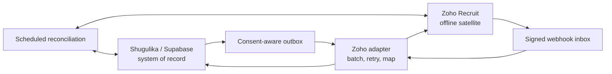

# D-1 — Zoho Recruit system-of-record decision

> **Status:** Proposed — merging this document records acceptance  
> **Decision:** Keep Shugulika/Supabase as the platform system of record. Use Zoho Recruit as a satellite for Shugulika-operated offline and legacy recruitment.  
> **Date:** 2026-07-30  
> **Scope:** Architecture and delivery plan only; no integration or schema changes are included.

## 1. Decision

Shugulika will keep the existing Supabase-backed platform as the authoritative source for:

- candidate identity, profile, documents, visibility, and consent;
- the shared pan-African candidate pool and franchise access boundaries;
- portal job orders, applications, pipeline stages, assessments, interviews, offers, and placements;
- employer self-service, packages, entitlements, billing, and unlock history;
- audit evidence, product analytics, and cross-franchise/HQ KPIs.

Zoho Recruit will be an **operational satellite** for Shugulika's offline and legacy recruitment work. It may hold a limited, consented projection of the candidates, requisitions, and activities needed by that team. Zoho may own operational fields that exist only inside a Zoho-managed offline case, such as a Zoho task, internal offline note, or Zoho email activity.

There will be no dual-master records. Every synchronized field must have one named owner. The Shugulika portal must remain usable when Zoho is unavailable.

This decision interprets “pivoted to Zoho Recruit” as an operating-system decision for the existing offline recruitment business, not as a mandate to replace the customer-facing Shugulika platform.

## 2. Why this decision is needed now

The meeting notes say both:

- “pivoted to using Zoho Recruit (for offline recruitment)”; and
- “focus purely on Zoho Recruit.”

Taken alone, the second statement could mean replacing the platform ATS. The repository shows that this would no longer be a simple vendor choice: Shugulika already has a substantial, product-specific recruitment system.

At the time of this decision, the application contains 55 migration files and 65 table definitions. It already implements:

- candidate-owned profiles, documents, preferences, search visibility, and purpose-specific consent in [`0001_mvp_schema.sql`](../../supabase/migrations/0001_mvp_schema.sql);
- tenant- and role-scoped access policies in [`0002_mvp_rls.sql`](../../supabase/migrations/0002_mvp_rls.sql);
- database-enforced pipeline transitions and mandatory gates in [`20260723124947_pipeline_gates_rpc.sql`](../../supabase/migrations/20260723124947_pipeline_gates_rpc.sql);
- candidate-directory access logging in [`20260723121714_recruiter_candidate_directory.sql`](../../supabase/migrations/20260723121714_recruiter_candidate_directory.sql);
- watermarked document access and export logging in [`20260723114157_document_watermarked_previews.sql`](../../supabase/migrations/20260723114157_document_watermarked_previews.sql);
- assessment, asynchronous interview, employer submission, and KPI domains described in the project [`README`](../../README.md);
- explicit cross-franchise isolation, employer boundaries, and consent rules in the [database security design](../database/07-security-and-rls.md).

There is currently no Zoho Recruit API client, mapping, webhook handler, OAuth connection, or external-record ledger in application code. Making Zoho authoritative would therefore require replacing or subordinating working platform behavior, not merely turning on an integration.

## 3. Vendor findings that affect the architecture

### Zoho is capable enough for offline ATS operations

Zoho Recruit is a credible operational ATS:

- [Blueprint](https://help.zoho.com/portal/en/kb/recruit/automation/blueprint/overview/articles/zoho-recruit-blueprint) can define states, transitions, required information, responsible users, and automated actions.
- [Roles and profiles](https://help.zoho.com/portal/en/kb/recruit/getting-started/roles-profiles/default-roles-profiles/articles/default-roles-profiles) can restrict modules, fields, actions, and record visibility.
- [Workflow rules](https://help.zoho.com/portal/en/kb/recruit/developer-guide/developer-console/dev-console-workflow-rules/articles/dev-console-workflow-rules) can send email/SMS alerts, update fields, run functions, and call webhooks.
- [OAuth 2.0 APIs](https://www.zoho.com/recruit/developer-guide/apiv2/oauth-overview.html) cover candidates, applications, job openings, interviews, assessments, notes, users, and settings.

Those capabilities make Zoho suitable for the internal offline process. They do not recreate Shugulika's employer marketplace, entitlement model, custom consent boundaries, or shared cross-franchise pool.

### Separate Zoho organizations would fragment the network

Zoho Recruit's [multiple-organization documentation](https://help.zoho.com/portal/en/kb/recruit/getting-started/account-set-up/multiple-organizations/articles/managing-multiple-recruit-organizations) is decisive:

- each organization is a separate account;
- the feature provides no data synchronization between organizations;
- subscriptions and user licenses are purchased separately; and
- integrations are connected to a selected organization account.

Creating one Zoho organization per franchise would therefore split the candidate pool and require Shugulika to rebuild cross-organization synchronization, deduplication, reporting, consent withdrawal, and access revocation outside Zoho. A central platform database is the cleaner home for the network asset.

A single shared Zoho organization can use roles, profiles, ownership, and sharing rules, but those controls must not be assumed equivalent to the repository's database-level franchise isolation. Direct franchise access to Zoho requires a permission pilot and adversarial access tests before approval.

### API and data-center limits require an asynchronous boundary

Zoho Recruit uses rolling API credits plus concurrency and sub-concurrency limits, documented in its [API limits](https://www.zoho.com/recruit/developer-guide/apiv2/limits.html). The integration must batch, retry with backoff, reconcile, and expose lag instead of putting Zoho calls in portal request paths.

Zoho Recruit is hosted across multiple data centers and uses data-center-specific API domains and secrets, as documented in [Multi DC support](https://www.zoho.com/recruit/developer-guide/apiv2/multi-dc.html). The integration must store the authorized account's returned domain and must not hardcode the US endpoint.

Zoho Accounts currently lists US, EU, India, Australia, Japan, Canada, and Saudi Arabia data centers in its [data-center documentation](https://help.zoho.com/portal/en/kb/accounts/manage-your-zoho-account/articles/data-center-for-zoho-account). Tanzania is not listed. The selected Zoho account location and transfer basis therefore require DPO/legal approval before real candidate data is copied.

This does not remove the existing Supabase residency gate. Supabase's [current region list](https://supabase.com/docs/guides/platform/regions) also has no African managed region. Production candidate data remains blocked until the documented cross-border-transfer and PDPC position in [OD-1 and OD-6](../database/12-open-decisions-and-risks.md) is approved.

## 4. Options considered

| Option | Benefits | Material problems | Decision |
| --- | --- | --- | --- |
| **A. Zoho Recruit is the sole system of record** | Mature internal ATS UI; Blueprint/workflow automation; fewer custom internal screens over time | Replaces or proxies working candidate, consent, RLS, pipeline, assessment, interview, employer, package, and KPI behavior; franchise topology fragments the network or weakens isolation; portal availability becomes tied to API limits and vendor uptime | Rejected |
| **B. Shugulika is authoritative; Zoho is an offline satellite** | Preserves the shared pool and existing security model; gives the offline team Zoho's operational tools; supports a narrow and reversible integration | Requires a mapping/outbox/reconciliation service and clear field ownership | **Selected** |
| **C. Both systems can edit the same records** | Appears flexible during migration | Creates conflicts, loops, stale consent, duplicate candidates, ambiguous audit history, and unsafe deletion behavior | Rejected |

Option B is the only option that satisfies both parts of the notes without discarding the platform's product-specific work.

## 5. Source-of-truth matrix

| Domain | Authority | Zoho treatment |
| --- | --- | --- |
| Candidate platform ID | Shugulika | Store as an immutable custom external ID; never identify solely by email |
| Candidate profile and contact details | Shugulika | Limited projection only when an offline case needs it and consent permits it |
| Candidate documents | Shugulika | Do not copy by default; copy a necessary version only with explicit purpose, access control, and retention |
| Search visibility and discovery opt-in | Shugulika | Do not let a Zoho field expand portal visibility |
| Consent, withdrawal, erasure request, legal hold | Shugulika | Propagate restriction/deletion work to Zoho; Zoho cannot grant platform consent |
| Franchise membership and tenant scope | Shugulika | No synchronization that grants broader platform access |
| Portal job order and advertised job | Shugulika | Optional read-only operational projection with external ID |
| Portal application and pipeline stage | Shugulika | Optional projection; Zoho cannot directly advance the authoritative portal stage |
| Assessments, video interviews, AI reviews, offers, placements | Shugulika | Summary/result projection only where operationally required |
| Employer package, subscription, CV unlock, invoice, payment | Shugulika | Never owned by Zoho Recruit |
| Zoho-only offline requisition | Zoho | Zoho owns until explicitly promoted into a portal job |
| Zoho-only task, email activity, and internal offline note | Zoho | Keep in Zoho; send only a safe status/outcome summary to Shugulika if required |
| Audit and synchronization history | Shugulika | Record every export, import, retry, conflict, restriction, and deletion result |

### Promotion rule for offline work

If a Zoho-only requisition is published to the Shugulika portal:

1. create a new Shugulika job order with the Zoho organization and record IDs;
2. snapshot the approved public job content;
3. make Shugulika authoritative for the portal job and all portal applications;
4. project portal status back to Zoho only through explicitly mapped, read-only fields; and
5. never merge Zoho candidates into portal candidates by email alone.

Zoho's [duplicate-record behavior](https://help.zoho.com/portal/en/kb/recruit/essentials/duplicate-check/check-duplicate-records/articles/checking-duplicate-records-in-zoho-recruit) can use unique fields such as email, but email is mutable and can be shared or mistyped. The integration mapping must use Shugulika UUIDs and Zoho record IDs.

## 6. Integration boundary

### Non-negotiable rules

1. **Server-side only.** Browser clients never receive a Zoho client secret, refresh token, or direct data API access.
2. **Asynchronous by default.** Portal requests commit to Supabase first. A durable outbox sends eligible changes to Zoho afterward.
3. **One owner per field.** The mapping registry names the system and field that can write each value.
4. **Idempotent operations.** Each operation has a stable event ID and external mapping; retries cannot create duplicate records.
5. **Webhooks plus reconciliation.** Zoho webhooks reduce delay, but a scheduled comparison repairs missed or out-of-order events. Zoho documents [webhooks](https://help.zoho.com/portal/en/kb/recruit/automation/workflow/webhooks) as workflow-triggered HTTP notifications, so they are not the sole source of truth.
6. **Consent before export.** The export worker checks current purpose, recipient/scope, and withdrawal state at execution time—not only when the outbox row was created.
7. **Restriction wins.** A withdrawal, erasure request, legal hold, or access revocation supersedes ordinary updates and blocks further export.
8. **Minimize data.** Only the fields needed for the offline purpose cross the boundary.
9. **Observable lag.** HQ can see last success, pending count, oldest pending age, failures, and reconciliation differences.
10. **No silent conflicts.** An unauthorized Zoho edit to a Shugulika-owned field is restored from Shugulika and recorded for review.

### Logical flow

The exact worker runtime is deferred to implementation. It may be a protected server worker, scheduled function, or equivalent. The invariant is durability and separation from user-facing requests.

### Minimum integration records

A later implementation should add private, server-only equivalents of:

- `integration_accounts`: Zoho organization ID, data-center domain, status, granted scopes, token reference, and last authorization;
- `external_record_mappings`: Shugulika type/ID ↔ Zoho organization/module/record ID;
- `integration_outbox`: immutable event ID, purpose, payload version, state, attempts, and next attempt;
- `integration_inbox`: webhook ID/hash, receipt time, verification result, and processing state;
- `integration_conflicts`: field owner, local/external values or hashes, resolution, and reviewer;
- `integration_reconciliations`: cursor, counts, differences, and completion status.

These tables must not be exposed to browser roles. Current Supabase guidance also notes that new tables may not be automatically exposed to the Data API; implementation must still use explicit grants and RLS/private-schema controls rather than relying on that default.

## 7. Franchise topology

### Initial operating model

- Use one Zoho Recruit organization for the Shugulika-operated offline recruitment team.
- Do not create a Zoho organization per franchise.
- Do not give employers or candidates Zoho accounts; they continue using the Shugulika portals.
- Do not give franchise teams direct Zoho access in the first integration release.
- HQ receives integration health and outcome reporting through Shugulika.

This keeps the shared candidate pool, consent, and cross-franchise rules centralized.

### Direct franchise access gate

Direct franchise access inside the central Zoho organization may be considered only after a sandbox pilot proves all of the following:

- Franchise A cannot list, search, export, report on, or infer Franchise B candidates, clients, jobs, notes, attachments, emails, or activities.
- Admin and support roles with broad access are restricted to named HQ staff.
- Sharing-rule and ownership changes are audited and included in a recurring access review.
- API credentials cannot bypass the intended franchise boundary without a separately controlled HQ service account.
- The DPO approves the data fields, data-center location, retention, and cross-border basis.

Failure of any test means franchises remain portal-only. It does **not** trigger one-Zoho-org-per-franchise, because that topology has no native data sync and would recreate the fragmentation this decision avoids.

## 8. Delivery plan

### Phase 0 — Business and compliance sign-off

- [ ] Confirm that “Zoho Recruit for offline recruitment” matches Sabiha's intended operating model.
- [ ] Choose the Zoho Recruit edition only after a feature/permission sandbox; Blueprint is currently documented for Enterprise, People Plus, and Zoho One.
- [ ] Record the Zoho organization, data center, controller/processor roles, DPA, retention, and cross-border basis.
- [ ] Name the offline team and the exact cases that are eligible for export.
- [ ] Approve the source-of-truth matrix and field-level data-minimization list.

**Exit:** Product owner, operations owner, security owner, and DPO approve the boundary. No production data is used before this exit.

### Phase 1 — Sandbox spike

- [ ] Create a non-production Zoho organization with synthetic candidates.
- [ ] Prove OAuth authorization, refresh, revocation, and data-center-aware API routing.
- [ ] Confirm module/field metadata and create the immutable Shugulika ID fields.
- [ ] Measure API-credit use for batched create, update, search, and reconciliation.
- [ ] Test duplicate, retry, out-of-order webhook, revoked token, deleted record, and rate-limit cases.
- [ ] Run the franchise access tests in section 7 if direct access is still desired.

**Exit:** A written spike report contains measured limits, field mappings, access-test results, and a go/no-go recommendation.

### Phase 2 — One-way offline projection

- [ ] Implement the private connection, mapping, and outbox records.
- [ ] Export only eligible candidates/requisitions after a current consent check.
- [ ] Add idempotent batched writes, exponential backoff, dead-letter review, and health metrics.
- [ ] Show integration state to authorized HQ/operations users.
- [ ] Keep Zoho edits from changing Shugulika-owned fields.

**Exit:** Synthetic and explicitly authorized pilot records reconcile with no duplicates or cross-scope leakage; portal behavior is unaffected during a Zoho outage.

### Phase 3 — Controlled return path and Zoho communications

- [ ] Accept signed/deduplicated Zoho webhook events into an inbox.
- [ ] Import only Zoho-owned offline status/outcome summaries.
- [ ] Reconcile missed events on a schedule.
- [ ] Allow Zoho interview emails only for Zoho-owned offline cases.
- [ ] Keep existing platform notifications authoritative for portal-owned applications.
- [ ] Exercise consent withdrawal, erasure, retention, and legal-hold procedures end to end.

**Exit:** Every imported field has an owner, every external communication is attributable, and restriction/deletion evidence is auditable.

### Phase 4 — Optional expansion

Only after pilot evidence:

- consider additional offline activities or result summaries;
- consider carefully scoped direct franchise access;
- consider promoting approved Zoho requisitions into portal jobs; and
- revisit vendor scope if Zoho replaces a discrete custom internal feature without weakening the platform boundary.

Employer marketplace, packages/credits, candidate self-service, billing, and the shared network pool remain out of scope for Zoho Recruit.

## 9. Acceptance and operating controls

The integration is ready for production only when:

- [ ] 100% of synchronized fields have a documented owner and purpose.
- [ ] Mapping and retry tests create no duplicate candidate, job, or application records.
- [ ] A Zoho outage or exhausted API-credit window does not block sign-in, applications, recruiter work, or employer decisions in Shugulika.
- [ ] Consent withdrawal prevents queued exports and produces a verified Zoho restriction/deletion result.
- [ ] Cross-franchise negative-access tests pass in both application and integration paths.
- [ ] OAuth tokens are encrypted, server-only, revocable, and scoped to the minimum approved modules/actions.
- [ ] Webhook authenticity, replay protection, and deduplication are tested.
- [ ] Reconciliation reports no unexplained differences for the pilot window.
- [ ] Integration exports/imports appear in the Shugulika audit trail.
- [ ] DPO/legal approval covers both the Supabase and Zoho locations and transfer paths.

Suggested operational indicators:

- oldest pending outbox event;
- successful/failed/retried operations by module;
- API credits consumed and rate-limit responses;
- webhook processing delay and duplicate count;
- reconciliation differences by field owner;
- restriction/deletion completion age; and
- records exported by consent purpose and franchise scope.

## 10. Consequences

### Positive

- The offline team can adopt Zoho without replacing the existing product.
- Shugulika preserves its differentiating shared pool, portals, consent model, packages, and analytics.
- The integration is reversible: disabling it stops projection without disabling the platform.
- Vendor API limits and outages degrade synchronization, not the customer experience.
- A later vendor change affects the adapter rather than the domain model.

### Cost and trade-offs

- Shugulika must build and operate a reliable adapter, mapping registry, and reconciliation process.
- Some offline data will exist in two systems and must follow coordinated retention and deletion procedures.
- Offline recruiters must understand which actions belong in Zoho and which belong in the portal.
- Zoho reports are not the authoritative network KPI source.
- Deep two-way customization is intentionally rejected even when it appears convenient.

## 11. Reversal and review triggers

Reopen this decision only if one of the following is demonstrated with evidence:

- the Shugulika employer marketplace and shared candidate pool are removed from product strategy;
- Zoho offers a verified tenant model that preserves the required shared pool plus database-equivalent franchise isolation;
- maintaining the custom platform ATS becomes economically or operationally unsustainable based on measured costs;
- law or regulator direction prohibits the selected platform/vendor topology; or
- an acquisition/migration plan explicitly accepts replacing the existing portals, controls, and data model.

Until then, new Zoho work must conform to the satellite boundary in this document.

## 12. Source record

Vendor documentation reviewed on 2026-07-30:

- [Zoho Recruit — Managing Multiple Organizations](https://help.zoho.com/portal/en/kb/recruit/getting-started/account-set-up/multiple-organizations/articles/managing-multiple-recruit-organizations)
- [Zoho Recruit — Blueprint](https://help.zoho.com/portal/en/kb/recruit/automation/blueprint/overview/articles/zoho-recruit-blueprint)
- [Zoho Recruit — Default Roles and Profiles](https://help.zoho.com/portal/en/kb/recruit/getting-started/roles-profiles/default-roles-profiles/articles/default-roles-profiles)
- [Zoho Recruit — API Limits](https://www.zoho.com/recruit/developer-guide/apiv2/limits.html)
- [Zoho Recruit — OAuth 2.0](https://www.zoho.com/recruit/developer-guide/apiv2/oauth-overview.html)
- [Zoho Recruit — Multi DC](https://www.zoho.com/recruit/developer-guide/apiv2/multi-dc.html)
- [Zoho Recruit — Webhooks](https://help.zoho.com/portal/en/kb/recruit/automation/workflow/webhooks)
- [Zoho Accounts — Data Center for Zoho Account](https://help.zoho.com/portal/en/kb/accounts/manage-your-zoho-account/articles/data-center-for-zoho-account)
- [Supabase — Available Regions](https://supabase.com/docs/guides/platform/regions)
- [Supabase — Breaking-change changelog](https://supabase.com/changelog?types=breaking-change)

Pricing is deliberately excluded because it changes frequently and depends on the final edition, users, and organization topology. Obtain a written quote after the sandbox identifies the required edition and number of licensed users.
