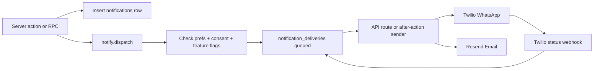

# WhatsApp + Email Notifications Plan

> **Status:** Planning only — not implemented.  
> **Providers:** Twilio WhatsApp (first), then Resend email.  
> **Author:** Baffoii

## Current state

- In-app notifications already work via `public.notifications` and RPCs (`notify_candidate_of_application_status`, `notify_staff_of_application`, etc.).
- No Resend/Twilio packages, env vars, or senders in code.
- WhatsApp is feature-flagged off (`whatsapp_enabled=false`) with consent purpose `whatsapp` already defined in [`src/lib/constants.ts`](../../src/lib/constants.ts).
- Profiles already have `email` + `phone` ([`profiles`](../../supabase/migrations/0001_mvp_schema.sql)).
- Full Domain P (`message_templates` / `message_deliveries`) exists only in draft SQL — **do not ship the full draft schema for MVP**. Use a slim outbox inspired by it.

## Locked decisions

| Decision | Choice |
| --- | --- |
| WhatsApp | **Twilio WhatsApp API** |
| Email | **Resend** (API key already available) |
| Phase 1 scope | Both channels designed; **implement WhatsApp first, then email** |
| Architecture | Channel-neutral adapter + delivery outbox; keep in-app as source of truth |

## Architecture



**Core idea:** every existing notify call keeps writing in-app rows. A new `dispatchOutboundNotification(...)` runs beside those calls (or from a thin wrapper around them), queues channel deliveries, and sends asynchronously so stage advances never block on Twilio/Resend.

### New modules (App Router)

- [`src/lib/notifications/types.ts`](../../src/lib/notifications/types.ts) — event keys, payloads, channels
- [`src/lib/notifications/catalog.ts`](../../src/lib/notifications/catalog.ts) — template copy per event × role × channel
- [`src/lib/notifications/dispatch.ts`](../../src/lib/notifications/dispatch.ts) — resolve recipients, check prefs/consent/flags, enqueue
- [`src/lib/notifications/providers/twilio-whatsapp.ts`](../../src/lib/notifications/providers/twilio-whatsapp.ts) — Twilio send
- [`src/lib/notifications/providers/resend-email.ts`](../../src/lib/notifications/providers/resend-email.ts) — Resend send (Phase 1b)
- [`src/app/api/notifications/deliver/route.ts`](../../src/app/api/notifications/deliver/route.ts) — drain queued deliveries (cron/manual/secret-protected)
- [`src/app/api/webhooks/twilio/route.ts`](../../src/app/api/webhooks/twilio/route.ts) — delivery status callbacks

### Slim schema migration

Create via `supabase migration new outbound_notifications` (do not invent filenames):

- `notification_deliveries` — `id`, `notification_id` (nullable FK), `user_id`, `channel` (`whatsapp`|`email`), `event_key`, `to_address`, `template_key`, `payload jsonb`, `status` (`queued`|`sending`|`sent`|`delivered`|`failed`|`skipped`), `provider`, `provider_message_id`, `failure_reason`, `attempts`, timestamps
- `notification_preferences` — per-user channel opt-in defaults (email on by default for transactional; WhatsApp off until consent)
- Enable feature flags: `whatsapp_enabled`, new `email_notifications_enabled`
- Flip `integration_connections.whatsapp` toward live when Twilio creds present

Reuse existing WhatsApp consent purpose; require active `candidate_consents` / equivalent opt-in before WhatsApp sends.

---

## Phase 0 — Provider prerequisites (manual ops)

### Twilio WhatsApp (do first)

1. Create/use a Twilio account; enable WhatsApp Sandbox for local/dev.
2. For production: register a **dedicated company WhatsApp Business sender** (Twilio-hosted number or bring-your-own).
   - **One company number can do both automation and manual replies** on the same WhatsApp identity.
   - Automation sends via Twilio API; staff reply manually through a Twilio-connected inbox (Console / Flex / Conversations / CRM) — not via the personal WhatsApp phone app on that same number.
   - Once a number is on the WhatsApp Business Platform (API), it typically **cannot** also stay logged into WhatsApp / WhatsApp Business on a phone. Do **not** register a recruiter’s personal daily WhatsApp number.
   - Prefer a dedicated Shugulika company line as `TWILIO_WHATSAPP_FROM`. Optional later: shared team inbox for human follow-ups in the 24h customer-care window.
3. Create **WhatsApp Content Templates** in Twilio for each transactional event (Meta requires pre-approved templates for business-initiated messages). Map template SIDs in env or DB.
4. Collect env vars:
   - `TWILIO_ACCOUNT_SID`
   - `TWILIO_AUTH_TOKEN`
   - `TWILIO_WHATSAPP_FROM` (e.g. `whatsapp:+14155238886` sandbox)
   - `TWILIO_WHATSAPP_STATUS_CALLBACK_URL`
   - Per-template SIDs (or one Content API template with variables)
5. Ensure user phones are E.164 (Tanzania `+255…`). Normalize on profile save / at send time.
6. Turn on `whatsapp_enabled` only after sandbox send succeeds.

### Resend domain verification (required before email sends)

Resend is domain-first: an API key alone cannot send until a domain is verified.

1. Own a domain (buy if needed: Cloudflare, Namecheap, etc.).
2. In [Resend Domains](https://resend.com/domains) → **Add Domain**. Prefer a subdomain for reputation isolation, e.g. `notify.yourdomain.com` or `send.yourdomain.com`.
3. Resend shows DNS records to add at your DNS host (exact values from the dashboard):
   - **DKIM** `TXT` (often `resend._domainkey…`)
   - **SPF** `TXT`
   - **Return-Path** `MX` (and sometimes related CNAME) for bounces
4. Copy records **exactly** into the DNS provider that actually serves the domain (confirm with [dns.email](https://dns.email) / `nslookup` if unsure).
5. Click **Verify** in Resend. Usually minutes; can take up to ~72h for DNS propagation. Use **Restart verification** if stuck.
6. After green checks, set:
   - `RESEND_API_KEY`
   - `RESEND_FROM_EMAIL` = e.g. `notifications@notify.yourdomain.com`
   - `RESEND_FROM_NAME` = `Shugulika`
   - Optional: `RESEND_REPLY_TO` = a real shared inbox (e.g. `careers@yourdomain.com`)
   - **No mailbox required for the From address** — it is a sending identity on the verified domain, not a Google/Microsoft account you must create. Only create a real inbox if you want that address to receive mail; otherwise use Reply-To for human replies.
7. Optional: add DMARC on the root/subdomain for deliverability.
8. Enable `email_notifications_enabled` only after a test send succeeds.

---

## Phase 1a — WhatsApp (implement first)

### Adapter + Twilio sender

- Add `twilio` dependency.
- Implement `sendWhatsApp({ to, contentSid, variables })` using Twilio Content/Messaging API.
- Skip send (status `skipped`) when: flag off, no phone, no WhatsApp consent, invalid E.164.
- Never throw into the request path that advanced a pipeline stage — log + mark `failed`.

### Wire event catalog (MVP event set)

| Audience | Event key | Hook point (existing) |
| --- | --- | --- |
| Candidate | `application.rejected` | [`rejectApplication`](../../src/app/recruiter/actions.ts) / `notifyCandidateStatus` |
| Candidate | `application.stage_advanced` (testing / interview / etc.) | `notifyCandidateStatus` via `moveApplicationToStage` |
| Candidate | `assessment.assigned` | `notify_candidate_of_assessment_assignment` path |
| Candidate | `interview.invited` | [`createAssignmentAction`](../../src/app/recruiter/interview-actions.ts) |
| Recruiter | `application.created` | `notify_staff_of_application` after [`applyToJobAction`](../../src/app/candidate/actions.ts) |
| Recruiter | `assessment.submitted` | **gap** — add notify in assessment submit actions |
| Recruiter | `interview.submitted` | already staff-notified from `submit_interview` |
| Recruiter | `job_order.submitted` / assigned | existing job-order notify paths |
| Employer | `job_order.approved` / `needs_revision` / `denied` | **gap** — add after approve/deny/request-changes actions |
| Employer | `submission.new_cvs` | **gap** — notify on `ensureEmployerSubmission` / client_submission |

Implementation pattern: after successful in-app notify, call `dispatchOutboundNotification({ eventKey, userIds, payload })` so WhatsApp (then later email) share one fan-out.

### Consent + settings UX

- Enable WhatsApp consent checkbox (remove “not enabled yet” copy when flag on).
- Settings toggle for WhatsApp notifications (candidates/recruiters/employers with a phone).
- Prefer staff/employer WhatsApp only with explicit opt-in (default off); candidates require consent purpose `whatsapp`.

### Delivery worker + webhook

- Secret-protected `POST /api/notifications/deliver` drains `queued` rows (batch size ~20, retry with backoff).
- Optional: fire-and-forget enqueue after dispatch for low latency in server actions.
- Twilio status webhook updates `sent` / `delivered` / `failed`.

---

## Phase 1b — Email (same adapter, second channel)

- Add `resend` dependency.
- Implement Resend provider using verified `RESEND_FROM_EMAIL`.
- Reuse the same event catalog with email subject/body variants (HTML + plain text; keep templates simple — no heavy React Email unless needed).
- Email default: transactional on for active users with a verified email; respect preference opt-outs for non-critical types later if needed.
- Same outbox + deliver worker; channel column distinguishes email vs WhatsApp.

---

## Env + config updates

Update [`.env.example`](../../.env.example) and [`scripts/validate-env.mjs`](../../scripts/validate-env.mjs):

```
TWILIO_ACCOUNT_SID=
TWILIO_AUTH_TOKEN=
TWILIO_WHATSAPP_FROM=
TWILIO_CONTENT_SIDS_JSON={"application.rejected":"HXxxx",...}
NOTIFICATIONS_DELIVER_SECRET=
RESEND_API_KEY=
RESEND_FROM_EMAIL=
RESEND_FROM_NAME=Shugulika
```

Gate sends on feature flags + presence of credentials so local/dev without Twilio still works.

---

## Implementation todos (when building)

1. Twilio WhatsApp sandbox + Content Templates + env vars; document setup
2. Complete Resend domain DNS verification; set `RESEND_FROM_*`
3. Migration: `notification_deliveries` + preferences; feature flags
4. Build channel-neutral dispatch + catalog + deliver API + Twilio provider
5. Wire existing notify hooks + fill gaps (assessment submit, job approve/deny, employer CV pack)
6. Enable WhatsApp consent/settings UX gated by `whatsapp_enabled`
7. Add Resend provider + email templates into same outbox/dispatch path
8. Unit/integration tests, `.env.example`, validate-env updates

---

## Testing

- Unit: template rendering, phone E.164 normalize, preference/consent gating, skip reasons.
- Integration: mock Twilio/Resend HTTP; assert outbox rows + status transitions.
- Manual: Twilio sandbox WhatsApp to a real phone for 2–3 events (reject, stage advance, new apply); Resend test after domain verify.
- Confirm stage advance still succeeds if Twilio is down (delivery fails independently).

---

## Out of scope for this phase

- Full Domain P schema / in-thread WhatsApp chat / applying via WhatsApp
- SMS OTP (separate flag)
- Marketing/broadcast campaigns
- Migrating Supabase Auth emails onto Resend (can be a follow-up)
