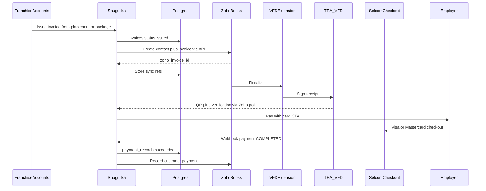

# Zoho Books, TRA VFD, Selcom, and Billing Expansion Plan

> **Status:** Planning only — not implemented.  
> **Providers:** Zoho Books + TRA VFD extension (first), then Selcom Visa/Mastercard.  
> **Author:** Baffoii

## Current state

- Billing schema exists: `packages`, `employer_subscriptions`, `invoices`, `invoice_items`, `payment_records` ([`0001_mvp_schema.sql`](../../supabase/migrations/0001_mvp_schema.sql)).
- Billing UIs at `/employer/billing`, `/franchise/billing`, `/hq/billing` are **read-only**; copy says payments are recorded manually.
- No Zoho, Selcom, TRA/VFD, or checkout code; `payments_enabled=false`; `integration_connections.payments` placeholder names Flutterwave/Selcom.
- Placement gate already requires `placement_id` to issue non-subscription invoices ([`pipeline_gates_rpc.sql`](../../supabase/migrations/20260723124947_pipeline_gates_rpc.sql)).
- Placeholders in [`PLACEHOLDER_FEATURES`](../../src/lib/constants.ts): `payments`, `recurring_billing`, `accounting_sync`.

## Locked decisions (pilot)

| Decision | Choice |
| --- | --- |
| Taxpayer / Zoho Books org | **Shugulika Tanzania franchise (Dar)** (`owning_org_id`) |
| Fiscalization path | **Zoho Books → marketplace/partner VFD extension → TRA VFD** |
| Source of truth | Shugulika = ops; Zoho = accounting + fiscalization (unless Phase 9) |
| Card payments | **Selcom** Visa/Mastercard (Phase 6) |
| Recurring | Manual until Phase 7 (OD-3) |

## Scope

**Primary (Phases 0–5):** Zoho Books API sync + VFD vendor selection/onboarding + fiscalized receipts.

**Follow-on (Phases 6–9):** Selcom checkout/webhooks; recurring auto-charge; multi-country Zoho/TIN; direct TRA VFD contingency.

---

## Phase 0 — Vendor selection and commercial onboarding

No code until these are underway. Owned by franchise/HQ ops + counsel.

### A. Zoho Books (Dar franchise)

- Create / confirm Zoho Books organization under the Tanzania franchise legal entity (TIN, name, address matching TRA).
- Configure TZ VAT, invoice numbering (Zoho auto-number vs Shugulika `invoice_number` as reference), chart of accounts for placement fees and package subscriptions.
- Register Zoho API OAuth client with scopes: contacts, invoices, customer payments, settings read.
- Secrets (env only): `ZOHO_CLIENT_ID`, `ZOHO_CLIENT_SECRET`, `ZOHO_REFRESH_TOKEN`, `ZOHO_ORGANIZATION_ID`, `ZOHO_DC`.

### B. VFD provider selection (required)

Shortlist Zoho Marketplace / partner VFD bridges (e.g. EPLS “VFD for Zoho Books”, local Zoho partners). Score on: TRA certification, fiscal fields returned (QR, verification code), cost, Dar support hours, credit notes/voids.

**Selection gate:** pick vendor → TRA VFD registration for franchise TIN → install on Dar Zoho org → sandbox fiscalize before Phase 4 engineering.

### C. Mapping rules

- Employer org → Zoho Customer; store `zoho_contact_id`.
- Line items → Zoho Items with correct VAT (package keys / placement fee).
- Fiscalize after Zoho invoice is created and marked sent; do not email a non-fiscal draft as a tax invoice.

### D. Selcom merchant onboarding (start in parallel; code in Phase 6)

- Contact Selcom for Checkout API: vendor ID, API key, API secret.
- Pilot: card-only (Visa + Mastercard); settlement under Dar franchise merchant.
- Plan for limited/no public test mode (controlled small live amounts or merchant sandbox).

---

## Phase 1 — Schema and feature flags

New migration (do not rewrite `0001`).

**Columns for Phases 1–5:**

- `invoices`: `zoho_invoice_id`, `zoho_sync_status`, `zoho_synced_at`, `fiscal_status`, `fiscal_verification_code`, `fiscal_qr_url`, `fiscalized_at`, `fiscal_error`
- Employers: `zoho_contact_id`, billing email / TIN if missing
- `payment_records`: `zoho_payment_id`, `provider` (`manual|selcom`), `provider_order_id`, `provider_trans_id`, `provider_reference`
- Optional `integration_sync_events` for debug

**Later (Phases 6–8):** subscription auto-charge fields; `organization_integrations` per franchise.

**Flags:** `accounting_sync` → Zoho; `tra_vfd` → vendor; `payments` → Selcom (`not_enabled` until Phase 6); keep `payments_enabled=false` until then. Update [`PLACEHOLDER_FEATURES`](../../src/lib/constants.ts).

RLS: reuse [`0002_mvp_rls.sql`](../../supabase/migrations/0002_mvp_rls.sql) — franchise accounts write; employer read own; HQ totals.

---

## Phase 2 — In-app invoice lifecycle

Prerequisite for sync. Billing pages are read-only today ([`StaffLists.tsx`](../../src/components/pages/StaffLists.tsx)).

1. Draft invoice from placement (`placements.fee`, `placement_id`, owning org = Dar).
2. Draft invoice from subscription (manual until Phase 7).
3. Issue → `status=issued` → enqueue Zoho sync.
4. Void / credit → sync to Zoho (ops runbook for post-fiscal rules).
5. Manual `payment_records` UI; optional Zoho Customer Payment push.

Primary UI: `/franchise/billing`. Employer `/employer/billing`: view + fiscal QR.

---

## Phase 3 — Zoho Books API client

Module: `src/lib/integrations/zoho/`

- OAuth refresh-token flow (server-only)
- `upsertCustomer`, `createInvoice`, `markInvoiceSent`, `voidInvoice`, `recordPayment`, `getInvoice`
- Idempotency via Shugulika `invoice_number` / UUID as Zoho reference
- Sync on issue; retry for `zoho_sync_status=pending`
- Extend [`.env.example`](../../.env.example) + [`scripts/validate-env.mjs`](../../scripts/validate-env.mjs)

---

## Phase 4 — Fiscalize via VFD extension

1. MVP ops: issue in Shugulika → Zoho invoice → fiscalize in extension → “Refresh fiscal status” stores `fiscal_*`.
2. Automate if vendor API allows.
3. Employer receipt: show QR/verification; prefer Zoho/extension PDF as legal document (TRA layout is strict).
4. Failures: `fiscal_status=failed`; block treating as tax invoice until fiscalized.

---

## Phase 5 — Hardening (Zoho + VFD)

- E2E: placement → draft → issue → Zoho → fiscalize → QR on franchise + employer billing
- Tests for totals + sync idempotency
- Runbook: credential rotation, void after fiscalization, TIN mismatch, rate limits
- Update [`README.md`](../../README.md) accounting sync placeholder

---

## Phase 6 — Selcom Visa/Mastercard checkout and webhooks

Depends on issued invoices (Phase 2); prefer fiscalized invoices (Phase 4) before card collect.

### Config

- Env: `SELCOM_VENDOR_ID`, `SELCOM_API_KEY`, `SELCOM_API_SECRET`, `SELCOM_BASE_URL`
- Enable `payments_enabled` + Selcom connection for TZ franchise only

### Checkout

1. Pay by card on unpaid issued invoice.
2. Create `payment_records` (`method=card`, `provider=selcom`, `pending`) + Selcom create-order (`order_id` idempotent, `currency=TZS`, card methods only, redirect + webhook URLs).
3. Redirect to Selcom payment page.
4. Confirm via webhook or order-status query.

### Webhook

- `POST /api/payments/selcom/webhook` — verify signed headers; on COMPLETED mark payment + invoice paid/partial; push Zoho payment; idempotent on `transid`/`order_id`.

### Module

- `src/lib/integrations/selcom/` — HMAC signing, create order, query status, webhook verify (thin custom client).

### Acceptance

- Happy path, duplicate webhook, cancel, amount mismatch; Zoho payment matches.

---

## Phase 7 — Recurring auto-charge (OD-3)

Enable only after Selcom is stable and merchant terms allow stored-card / on-demand charges.

- Opt-in `auto_activate_intent`; store Selcom `gateway_buyer_uuid` (not PAN).
- Daily job: due subscriptions → issue (+ fiscalize) then charge; prefer fiscalize-before-charge for tax compliance.
- Success → extend period; failure → notify, after N failures → `suspended`.
- Feature flag `recurring_billing` separate from one-off payments; no burnable wallet (OD-2).

---

## Phase 8 — Multi-country Zoho orgs / multi-TIN

- `organization_integrations` per franchise: Zoho org id, TIN, VFD vendor, Selcom vendor, secrets ref.
- Resolve credentials by `invoices.owning_org_id`.
- Pluggable `FiscalProvider` (TZ first; other regimes later).
- Migrate Phase 0–5 Dar env vars into Dar’s integration row without behavior change.

---

## Phase 9 — Direct TRA VFD API (contingency)

**Not the default.** Activate only if Zoho VFD extension fails vendor/SLA gates.

- Shugulika calls TRA-certified VFD provider API directly; Zoho becomes accounting-only.
- Same `invoices.fiscal_*` fields; TRA receipt layout compliance required.
- `FiscalProvider`: `ZohoExtensionFiscalProvider` (default) vs `DirectVfdFiscalProvider`.

Risks: own TRA certification path, Zoho/fiscal drift, higher compliance ownership.

---

## Implementation order

| Step | Deliverable |
| --- | --- |
| 0 | VFD vendor RFP + Dar Zoho org + TRA VFD registration; start Selcom signup |
| 1 | Migration: sync + fiscal (+ payment provider) columns, flags |
| 2 | Invoice create/issue/void + manual pay UI |
| 3 | Zoho OAuth client + customer/invoice sync |
| 4 | Fiscal status refresh + QR display |
| 5 | Staging acceptance for Zoho + VFD |
| 6 | Selcom card checkout + webhook + Zoho payment push |
| 7 | Recurring auto-charge job + opt-in UX |
| 8 | Per-franchise `organization_integrations` + multi-TIN |
| 9 | Direct TRA VFD **only if** Zoho extension path fails |

## Dependency summary

- Phases 0–5 unlock legal invoicing in TZ
- Phase 6 unlocks employer self-serve card pay
- Phase 7 depends on Phase 6 stored-buyer + merchant terms
- Phase 8 depends on second country/legal entity
- Phase 9 is a fork, not a sequential necessity

---

## Implementation todos (when building)

1. Complete Phase 0 vendor selection + Zoho/TRA/Selcom onboarding
2. Schema migration + feature flags for Zoho/fiscal/payment provider fields
3. Franchise accounts invoice lifecycle (draft/issue/void + manual pay)
4. Zoho Books OAuth client + sync on issue
5. VFD fiscal refresh + QR on billing UIs
6. Selcom checkout + webhook + Zoho payment push
7. Recurring billing job (after Selcom stable)
8. Multi-franchise `organization_integrations` when expanding countries
9. Direct VFD adapter only if contingency triggered
